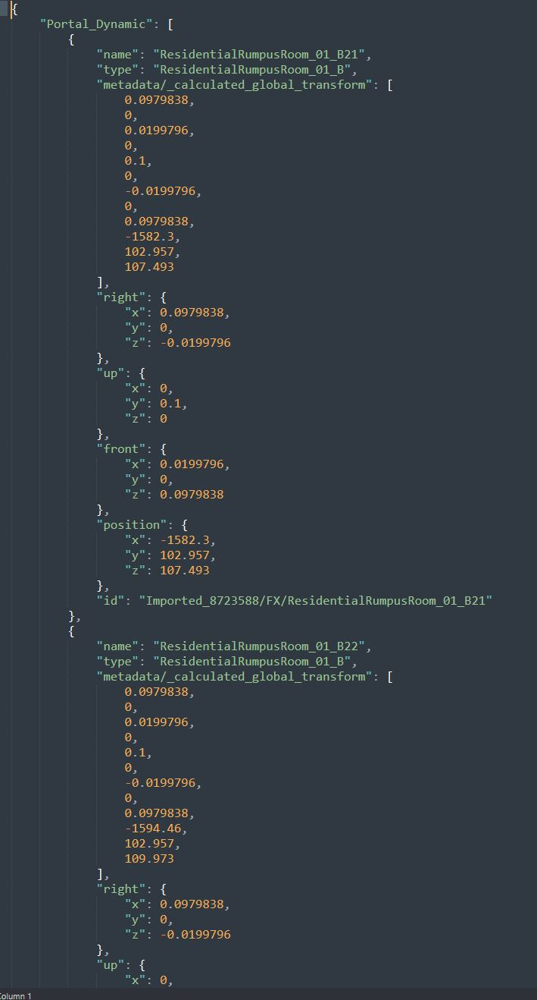

# BF6 Portal JSON Importer

A Godot 4.4.1 addon for importing JSON scene data exported from the Battlefield 6 Portal SDK.
It currently ONLY supports the spatial .json files directly exported from Godot and currently does not support the experience.json files.

This was vibecoded and hacked together in 2 hours.

## Installation

Extract or clone the repository into your Godot project's addons folder:
`res://addons/BF6PortalJsonImporter`
(or simply drag the folder into your project's `addons` directory).

## Enable Plugin

1.  Open your Godot project.
2.  Go to **Project** -> **Project Settings**.
3.  Click the **Plugins** tab.
4.  Find **BF6 Portal JSON Importer** and check the **Enable** box.

## Usage

1.  **Open Dock**: The plugin adds a dock tab named "BF6 Portal JSON Importer" (check your dock tabs, usually on the left or search for it).
2.  **Select Export**: Click **Browse** and select your `.json` export file from the SDK.

### Buttons & Actions

-   **Rebuild to Current Scene**:
    -   Rebuilds the level and import objects into the currently open scene.

-   **Create .tscn File**:
    -   Saves the imported objects as a new `.tscn` scene file.
    -   **IMPORTANT**: If you drag this created `.tscn` file into another scene, you must right-click the node instance in the scene tree and select **Make Local**.
    -   This step is only required for the `.tscn` workflow, not when using "Rebuild to Current Scene".*

-   **Open Output Folder**:
    -   Opens the file explorer to the location where `.tscn` files are saved.

> [!NOTE]
> - The importer restores the **final world position** of every object.
> - Individual local transforms of parent/child relationships are **not** preserved; everything is placed based on its calculated world transform.
> - Gameplay assets, logic, and specific parameters from the original metadata may not be properly restored or mapped.

## Troubleshooting

### Error: "Unable to load the extension script"
If you see an error about being unable to load `bf6_portal_json_importer.gd`:
1. Ensure the plugin files are not nested (e.g. `addons/Folder/Folder/...`).
2. Try renaming the plugin folder to exactly `BF6PortalJsonImporter` and restart Godot.

## Requirements

-   **Godot 4.x** (Tested in 4.4.1)
-   **Object Library**: Your project must have the corresponding `.tscn` files in `res://objects/`. The importer searches recursively for filenames matching the JSON entries.
